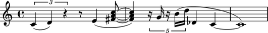
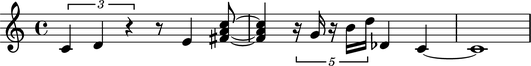
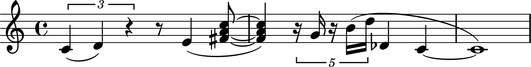

Creating rest-delimited slurs
=============================

Take a look at the slurs in the following example and notice that 
there is a pattern to how they arranged.

The pattern?  Slurs in the example span groups of notes and chords separated by rests.

Abjad makes it easy to create such rest-delimited slurs in a structured way.

Let's start with the notes, rests and chords like this:

::

   >>> string = r"\times 2/3 { c'4 d' r } r8 e'4 <fs' a' c''>8 ~ q4 \times 4/5 { r16 g' r b' d'' } df'4 c' ~ c'1"
   >>> staff = Staff(string)
   >>> show(staff)

Next we'll group notes and chords together with one of the functions
available in the ``componenttools`` package, and add slur spanners inside
our loop:

::

   >>> leaves = iterationtools.iterate_leaves_in_expr(staff)
   >>> for group in componenttools.yield_groups_of_mixed_klasses_in_sequence(leaves, (Note, Chord)):
   ...     spannertools.SlurSpanner(group)
   ... 
   SlurSpanner(c'4, d'4)
   SlurSpanner(e'4, <fs' a' c''>8, <fs' a' c''>4)
   SlurSpanner(g'16)
   SlurSpanner(b'16, d''16, df'4, c'4, c'1)

And now we can take a look at the result:

::

   >>> show(staff)

Notice now that there's a little problem with the notation we just created.

Four SlurSpanners were generated, but only three slurs are shown.

Why?  LilyPond ignores slur terminators attached to the same note as the slur begins on.

Let's rewrite our example to prevent that from happening:

::

   >>> staff = Staff(string)
   >>> leaves = iterationtools.iterate_leaves_in_expr(staff)
   >>> klasses = (Note, Chord)
   >>> for group in componenttools.yield_groups_of_mixed_klasses_in_sequence(leaves, klasses):
   ...     if 1 < len(group):
   ...         spannertools.SlurSpanner(group)
   ... 
   SlurSpanner(c'4, d'4)
   SlurSpanner(e'4, <fs' a' c''>8, <fs' a' c''>4)
   SlurSpanner(b'16, d''16, df'4, c'4, c'1)

And now the corrected result:

::

   >>> show(staff)

