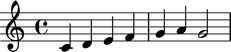

Making grob overrides
=====================

Grob-override component plug-ins
--------------------------------

All Abjad containers have a grob-override plug-in:

::

   >>> staff = Staff("c'4 d'4 e'4 f'4 g'4 a'4 g'2")
   >>> show(staff)

::

   >>> staff.override.staff_symbol.color = 'blue'
   >>> staff.override
   LilyPondGrobOverrideComponentPlugIn(staff_symbol__color='blue')

::

   >>> show(staff)

All Abjad leaves have a grob-override plug-in, too:

::

   >>> leaf = staff[-1]

::

   >>> leaf.override.note_head.color = 'red'
   >>> leaf.override.stem.color = 'red'
   >>> leaf.override
   LilyPondGrobOverrideComponentPlugIn(note_head__color='red', stem__color='red')

::

   >>> show(staff)

And so do Abjad spanners:

::

   >>> slur = spannertools.SlurSpanner(staff[:])
   >>> slur.override.slur.color = 'red'
   >>> slur.override
   LilyPondGrobOverrideComponentPlugIn(slur__color='red')

::

   >>> show(staff)

Grob proxies
------------

Grob-override plug-ins contain grob proxies:

::

   >>> leaf.override.note_head
   LilyPondGrobProxy(color = 'red')

::

   >>> leaf.override.stem
   LilyPondGrobProxy(color = 'red')

