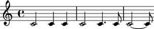

Mapping lists to rhythms
========================
Let's say you have a list of numbers that you want to convert into rhythmic notation. This is very easy to do. There are a number of related topics that are presented separately as other tutorials.

Simple example
--------------

First create a list and then turn that list into a list of durations using Fractions that are created as intermediate values.
::

   >>> dur_list = [4,2,2,4,3,1]
   >>> dur_list_as_durations = [durationtools.rational_to_duration_pair_with_specified_integer_denominator(Fraction(d,8),8) for d in dur_list]

The resulting list of tuples should look something like musical durations. Now we notate them using a single pitch.

::

   >>> note_list = [Note(0, dur_pair) for dur_pair in dur_list_as_durations]
   >>> staff = Staff(note_list)
   >>> show(staff)

There we have it. Durations notated based on a simple list of numbers. Read the tutorials on splitting rhythms based on beats or bars in order to notate more complex duration patterns. Also, consider how changing the denominator in the Fraction above would change the series of durations.

=tms
