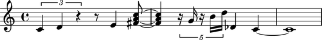

Creating rest-delimited slurs
=============================

Take a look at the slurs in the following example and notice that 
there is a pattern to how they arranged.

(Insert image of final example here.)

Slurs in the example span groups of notes and chords separated by rests.

Abjad makes it easy to create such rest-delimited slurs in a structured way.

We can start with the notes, rests and chords like this:

::

   >>> staff = Staff(r"\times 2/3 { c'4 d'4 r4 } \times 2/3 { e'4 f'4 r4 }")
   >>> show(staff)

Now we can group notes and chords together with one of the functions
available in the ``componenttools`` package and add slur spanners inside
our loop:

::

   >>> leaves = leaftools.iterate_leaves_forward_in_expr(staff)
   >>> for group in componenttools.yield_groups_of_mixed_klasses_in_sequence(leaves, (Note, Chord)):
   ...     spannertools.SlurSpanner(group)
   ... 
   SlurSpanner(c'4, d'4)
   SlurSpanner(e'4, f'4)

And now we can take at the result:

::

   >>> show(staff)

