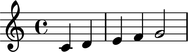

Understanding time signature marks
==================================

In this tutorial we take a deeper look at what happens
when we attach time signature marks to staves and other score components.

At the end of the tutorial you'll understand how time signature marks are created.

You'll also understand how the states of different objects change when
time signature marks are attached and detached.

Getting started
---------------

We start by creating a staff full of notes:

::

   >>> staff = Staff("c'4 d'4 e'4 f'4 g'2")

If we ask the Abjad interpreter about our staff reference Abjad will respond
with the interpreter display of the object:

::

   >>> staff
   Staff{5}

The ``5`` in ``Staff{5}`` shows that the staff contains 5 top-level components.
The curly braces in ``Staff{5}`` show that the contents of the staff are to be read
sequentially through time rather than in parallel.

Before we get to time signature marks let's take a moment and examine the state of
the staff we've created. We can motivate this a bit by asking two questions:

1. what time signature is currently in effect for the staff we have just created?
2. what is the time signature currently in effect for
   the five notes contained within the staff we have just created?

The answer to both questions is the same:
there is no time signature currently in effect for either our staff
or for the five notes it contains.

We can see that this is the case with tools from the API:

::

   >>> contexttools.get_effective_time_signature(staff) is None
   True

And:

::

   >>> for leaf in staff:
   ...     contexttools.get_effective_time_signature(leaf) is None
   ... 
   True
   True
   True
   True
   True

And we can iterate both the staff and its leaves at one and the same time like this:

::

   >>> for component in iterationtools.iterate_components_in_expr(staff):
   ...     component, contexttools.get_effective_time_signature(component)
   ... 
   (Staff{5}, None)
   (Note("c'4"), None)
   (Note("d'4"), None)
   (Note("e'4"), None)
   (Note("f'4"), None)
   (Note("g'2"), None)

This confirms the answer to our questions that there is not yet any time signature
in effect for any component in our staff because we have not yet attached
a time signature mark to any component in our staff.

LilyPond's implicit ``4/4``
---------------------------

So what happens if we format our staff and send it off to LilyPond to render as a PDF?
Will LilyPond render the staff with a time signature? Without a time signature?
Will LilyPond refuse to render the example at all?

We find out like this:

::

   >>> show(staff)

It turns out LilyPond defaults to a time signature of ``4/4``.

What's important to note here is that because we have not yet attached
a time signature mark any component in our staff Abjad says
"no effective time signature here" while LilyPond says
"OK, I'll default to ``4/4`` so we can get on with rendering your music."

We can further confirm that this is the case by asking Abjad for the LilyPond format of our staff:

::

   >>> f(staff)
   \new Staff {
       c'4
       d'4
       e'4
       f'4
       g'2
   }

The LilyPond format of our staff contains no LilyPond ``\time`` command.
This is, again, because we have not yet attached a time signature mark
to any component in our staff.

Using time signature marks
--------------------------

We can now practice attaching and detaching time signature marks
to different components in our staff and study what happens as we do.

We'll start with ``3/4``.

The easiest thing to do is to attach a time signature mark to the staff itself.

We'll do this in two separate steps and study each step to understand exactly what's going on.

First, we create a ``3/4`` time signature mark:

::

   >>> time_signature_mark = contexttools.TimeSignatureMark((3, 4))

If we ask the Abjad interpreter for the interpreter dispaly of
our time signature mark we get the following:

::

   >>> time_signature_mark
   TimeSignatureMark((3, 4))

All this tells us is that we have in fact created a ``3/4`` time signature mark.
Nothing too exciting yet.
At this point our ``3/4`` time signature is not yet attached to anything.
We could say that the "state" of our time signature mark is "unattached."
And we can see this like so:

::

   >>> time_signature_mark.start_component is None
   True

What does it mean for a time signature mark to have ``'start_component'`` equal to none?
It means that the time signature isn't yet attached to any score component anywhere.

So now we attach our time signature mark to our staff:

::

   >>> time_signature_mark.attach(staff)
   TimeSignatureMark((3, 4))(Staff{5})

Abjad responds immediately by returning the time signature mark we have just attached.

Notice that our time signature mark's repr has changed.
The repr of our ``3/4`` time signature mark now includes the repr of the staff
to which we have just attached the time signature mark.
That is to say that the repr of our time signature mark is statal.

Our time signature mark has transitioned from an "unattached" state to an "attached" state.
We can see this like so:

::

   >>> time_signature_mark.start_component
   Staff{5}

And our staff has likewise transitioned from a state of having
no effective time signature to a state of having an effective time signature:

::

   >>> contexttools.get_effective_time_signature(staff)
   TimeSignatureMark((3, 4))(Staff{5})

And what about the leaves inside our staff?
Do the leaves now "know" that they are governed by a ``3/4`` time signature?

Indeed they do:

::

   >>> for leaf in staff.leaves:
   ...     leaf, contexttools.get_effective_time_signature(leaf)
   ... 
   (Note("c'4"), TimeSignatureMark((3, 4))(Staff{5}))
   (Note("d'4"), TimeSignatureMark((3, 4))(Staff{5}))
   (Note("e'4"), TimeSignatureMark((3, 4))(Staff{5}))
   (Note("f'4"), TimeSignatureMark((3, 4))(Staff{5}))
   (Note("g'2"), TimeSignatureMark((3, 4))(Staff{5}))

So to briefly resume:

What we just did was to:

1. create a time signature mark
2. attach the time signature to a score component

This 2-step pattern is always the same when dealing with context marks: create then attach.

(We will find out later that there are short-cuts for different parts of this process.
Right now we've chosen to create in a first step and attach in a second step
so that we can examine the changing states of the objects involved.)

Before moving on let's look at the PDF corresponding to our staff:

::

   >>> show(staff)

And let's confirm what we see in the PDF in the staff's format:

::

   >>> f(staff)
   \new Staff {
       \time 3/4
       c'4
       d'4
       e'4
       f'4
       g'2
   }

The staff's format now contains a LilyPond ``\time`` command because we have attached an Abjad time signature mark to the staff.

What we've just been through above will cover over 80% of what you'll ever wind up doing 
with time signature marks: creating them and attaching them directly to staves. 
But what if we wanna get rid of a time signature mark? 
Or what if the time signature will be changing all over the place? 
We cover those cases next.

Detaching a time signature mark is easy:

::

   >>> time_signature_mark.detach()
   TimeSignatureMark((3, 4))

The Abjad returns the mark we have just detached. 
And, observing the repr of the time signature mark, 
we see that the time signature mark has again changed state: 
the time signature mark has transitioned from attached to unattached. 
We confirm this like so:

::

   >>> time_signature_mark.start_component is None
   True

And also like so:

::

   >>> contexttools.get_effective_time_signature(staff) is None
   True

Yup: our time signature mark knows nothing about our staff. And vice versa. This is good.

So now what if we want to set up a time signature of ``2/4``? That fits our music, too.

We have a couple of options.

We can simply create and attach a new time signature mark:

::

   >>> duple_time_signature_mark = contexttools.TimeSignatureMark((2, 4))
   >>> duple_time_signature_mark.attach(staff)
   TimeSignatureMark((2, 4))(Staff{5})

::

   >>> f(staff)
   \new Staff {
       \time 2/4
       c'4
       d'4
       e'4
       f'4
       g'2
   }

::

   >>> show(staff)

Yup. That works.

On the other hand, we could simply reuse our previous ``3/4`` time signature mark.

To do this we'll first detach our ``2/4`` time signature mark ...

::

   >>> duple_time_signature_mark.detach()
   TimeSignatureMark((2, 4))

... confirm that our staff is now time signatureless ...

::

   >>> contexttools.get_effective_time_signature(staff) is None
   True

::

   >>> f(staff)
   \new Staff {
       c'4
       d'4
       e'4
       f'4
       g'2
   }

... reattach our previous ``3/4`` time signature ...

::

   >>> time_signature_mark.attach(staff)
   TimeSignatureMark((3, 4))(Staff{5})

... change the numerator of our time signature mark ...

::

   >>> time_signature_mark.numerator = 2

... and check to make sure that everything is as it should be:

::

   >>> contexttools.get_effective_time_signature(staff)
   TimeSignatureMark((2, 4))(Staff{5})
   >>> time_signature_mark.start_component
   Staff{5}

::

   >>> f(staff)
   \new Staff {
       \time 2/4
       c'4
       d'4
       e'4
       f'4
       g'2
   }

::

   >>> show(staff)

And everything works as it should.

To change to, for example, ``4/4`` we change just change the time signature mark's numerator again:

::

   >>> time_signature_mark.numerator = 4

::

   >>> f(staff)
   \new Staff {
       \time 4/4
       c'4
       d'4
       e'4
       f'4
       g'2
   }

First-measure pick-ups
----------------------

But what if our time signature has a ``2/4`` pick-up?

The LilyPond command for pick-ups is ``\partial``.
Abjad time signature marks implement this as a read / write attribute:

::

   >>> time_signature_mark.partial = Duration(2, 4)

::

   >>> f(staff)
   \new Staff {
       \partial 2
       \time 4/4
       c'4
       d'4
       e'4
       f'4
       g'2
   }

::

   >>> show(staff)

And what if time signature changes all over the place?

We'll use the trivial example of a measure in ``4/4`` followed by a measure in ``2/4``.

To do this we will need two time signature marks.

We've already got a ``4/4`` time signature mark attached to our staff:

::

   >>> f(staff)
   \new Staff {
       \partial 2
       \time 4/4
       c'4
       d'4
       e'4
       f'4
       g'2
   }

Let's get rid of the pick-up:

::

   >>> time_signature_mark.partial = None

::

   >>> f(staff)
   \new Staff {
       \time 4/4
       c'4
       d'4
       e'4
       f'4
       g'2
   }

Now what about the ``2/4`` time signature mark?

We create it in the usual way:

::

   >>> duple_time_signature_mark = contexttools.TimeSignatureMark((2, 4))
   >>> duple_time_signature_mark
   TimeSignatureMark((2, 4))

But should we attach it?
We can't attach our ``2/4`` time signature to our staff because
we've already attached our ``4/4`` time signature to our staff.
And it only makes sense to attach one time signature to any given score component.

Observe that we've built our score in a very straightforward way:
we have a single staff that contains a (flat) sequence of notes.
This means that we have only one choice for where to attach
the new ``2/4`` time signature mark.
And that is one the ``g'2`` that comes on the downbeat of the second measure.
We do that like this:

::

   >>> duple_time_signature_mark.attach(staff[4])
   TimeSignatureMark((2, 4))(g'2)

::

   >>> f(staff)
   \new Staff {
       \time 4/4
       c'4
       d'4
       e'4
       f'4
       \time 2/4
       g'2
   }

::

   >>> show(staff)

And everything works as we would like.

Incidentally, ``staff[4]`` means the component sitting at index ``4`` inside our staff.
Using the interpreter we can verify that this is ``g'2``:

::

   >>> staff[4]
   Note("g'2")

Depending on how we had chosen to build our staff we would have had
more options for where to attach our ``2/4`` time signature mark.
If, for example, we had chosen to populate our staff with a series
of measures then it's possible we could have attached
our ``2/4`` time signature to a measure instead of a note.

Time signature API
------------------

That covers the vast majority of things you'll do with time signature marks.

But before we stop we should mention another useful API function
and then talk about some short-cuts.

First an API function to detach ALL context marks attaching to a component:

We call the function a first time:

::

   >>> contexttools.detach_context_marks_attached_to_component(staff)
   (TimeSignatureMark((4, 4)),)

::

   >>> f(staff)
   \new Staff {
       c'4
       d'4
       e'4
       f'4
       \time 2/4
       g'2
   }

And then a second time:

::

   >>> contexttools.detach_context_marks_attached_to_component(staff[4])
   (TimeSignatureMark((2, 4)),)

::

   >>> f(staff)
   \new Staff {
       c'4
       d'4
       e'4
       f'4
       g'2
   }

Now there are now context marks of any sort attached to our staff or to the notes in our staff.

Be careful with this function, though: it removes *all* context marks.
So even though we just used the function to remove time signature marks,
it also would have removed any clef marks or tempo marks
if we had had those attached to our score, too.

And now for the short-cuts:

Our staff currently has no time signature marks attached:

::

   >>> f(staff)
   \new Staff {
       c'4
       d'4
       e'4
       f'4
       g'2
   }

So to recreate our ``3/4`` time signature we can do this ...

::

   >>> time_signature_mark = contexttools.TimeSignatureMark((3, 4))

... and then use a short-cut to avoid calling ``time_signature_mark.attach()`` like this:

::

   >>> time_signature_mark(staff)
   TimeSignatureMark((3, 4))(Staff{5})

::

   >>> f(staff)
   \new Staff {
       \time 3/4
       c'4
       d'4
       e'4
       f'4
       g'2
   }

What's going on here is that all context marks implement
the special ``__call__()`` method as a short-cut for ``attach()``.
What is the special ``__call__()`` method?
The ``__call__()`` method is what makes a function, class
or any other Python object callable.
The statement ``time_signature_mark(staff)`` has has parentheses in it
because the time signature mark is callable;
and the time signature mark is callable because all context marks
implement the special ``__call__()`` method.

Note too that all context marks understand an *empty call* as a short-cut
for ``detach()``. Like this:

::

   >>> time_signature_mark()
   TimeSignatureMark((3, 4))

::

   >>> f(staff)
   \new Staff {
       c'4
       d'4
       e'4
       f'4
       g'2
   }

The empty call made against the time signature mark causes
the time signature mark to detach from its start component.

The fact that context marks implement the special ``__call__()`` method
as a short-cut for attach() means that context marks
can be created and attached in a single line:

::

   >>> contexttools.TimeSignatureMark((2, 4))(staff)
   TimeSignatureMark((2, 4))(Staff{5})

::

   >>> f(staff)
   \new Staff {
       \time 2/4
       c'4
       d'4
       e'4
       f'4
       g'2
   }

What's going on here?

What's going on is that ``contexttools.TimeSignatureMark((2, 4))`` creates
a time signature mark in the usual way and that -- immediately after this --
the newly created time signature mark is available for us to call it against our staff.

This last short-cut form of ...

::

    >>> contexttools.TimeSignatureMark((2, 4))(staff)

... is the usual way that you will see context marks of all sorts presented in the docs.
