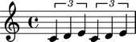

Working with component parentage
================================

Many score objects contain other score objects.

::

   >>> tuplet = Tuplet(Fraction(2, 3), "c'4 d'4 e'4")
   >>> staff = Staff(2 * tuplet)
   >>> score = Score([staff])

::

   >>> show(score, docs=True)

Abjad uses the idea of parentage to model the way objects contain each other.

Improper parentage
------------------

The improper parentage of the first note in score begins with the note itself:

::

   >>> note = score.leaves[0]

::

   >>> note.parentage
   Parentage(Note("c'4"), Tuplet(2/3, [c'4, d'4, e'4]), Staff{2}, Score<<1>>)

::

   >>> note.parentage[:]
   (Note("c'4"), Tuplet(2/3, [c'4, d'4, e'4]), Staff{2}, Score<<1>>)

Proper parentage
----------------

The proper parentage of the note begins with only the immediate parent of the note:

::

   >>> note.parentage[1:]
   (Tuplet(2/3, [c'4, d'4, e'4]), Staff{2}, Score<<1>>)

.. note:: the length of the improper parentage of any component equals
    the length of the proper parentage of the component plus ``1``.

Parentage attributes
--------------------

Use Parentage to find score depth:

::

   >>> note.parentage.depth
   3

Or score root:

::

   >>> note.parentage.root
   Score<<1>>

Or to find whether a component has no (proper) parentage at all:

::

   >>> note.parentage.is_orphan
   False

