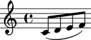
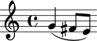

Working with logical voices
===========================

What is a logical voice?
------------------------

A logical voice is a structural relationship. Abjad uses the concept of the
logical voice to bind together all the notes, rests, chords and tuplets that
comprise a single musical voice.

It's important to understand what logical voices are and how they impact the
way that you may group notes, rests and chords together with beams, slurs and
other spanners.

Logical voices vs. explicit voices
----------------------------------

Logical voices and explicit voices are different things. The staff below
contains an explicit voice. You can slur these notes together because notes
contained in an explicit voice always belong to the same logical voice:

::

   >>> voice = Voice("c'8 d'8 e'8 f'8")
   >>> staff = Staff([voice])
   >>> notes = voice.select_leaves()
   >>> slur = spannertools.SlurSpanner()
   >>> slur.attach(notes)
   >>> show(staff)

Here is a staff without an explicit voice. You can slur these notes together
because both Abjad and LilyPond recognize that the notes belong to the same
logical voice even though no explicit voice is present:

::

   >>> staff = Staff("g'4 fs'8 e'8")
   >>> notes = staff.select_leaves()
   >>> slur = spannertools.SlurSpanner()
   >>> slur.attach(notes)
   >>> show(staff)

Different voice names determine different logical voices
--------------------------------------------------------

Now let's consider a slightly more complex example.  The staff below contains
two short voices written one after the other.  It's unusual to think of musical
voices as following one after the other on the same staff. But the example 
keeps things simple while we explore the way that the names of explicit voices
impact Abjad's determination of logical voices:

::

   >>> voice_1 = Voice("c'16 d'16 e'16 f'16", name='First Short Voice')
   >>> voice_2 = Voice("e'8 d'8", name='Second Short Voice')
   >>> staff = Staff([voice_1, voice_2])
   >>> show(staff)

You can't tell that the score above comprises two voices from the notation
alone. But the LilyPond input makes this clear:

::

   >>> f(staff)
   \new Staff {
       \context Voice = "First Short Voice" {
           c'16
           d'16
           e'16
           f'16
       }
       \context Voice = "Second Short Voice" {
           e'8
           d'8
       }
   }

You can slur together the notes in the first voice:

::

   >>> notes = voice_1.select_leaves()
   >>> slur = spannertools.SlurSpanner()
   >>> slur.attach(notes)
   >>> show(staff)

And you can slur together the notes in the second voice:

::

   >>> notes = voice_2.select_leaves()
   >>> slur = spannertools.SlurSpanner()
   >>> slur.attach(notes)
   >>> show(staff)

But you can not slur together all the notes in the staff.

Why? Because the six notes in the staff above belong to two different logical
voices.  Abjad will raise an exception if you try to slur these notes together.
And LilyPond would refuse to render the resulting input code even if you could.

The important point here is that explicit voices carrying different names
determine different logical voices. The practical upshot of this is that voice
naming constrains which notes, rests and chords you can group together with
slurs, beams and other spanners.

Identical voice names determine a single logical voice
------------------------------------------------------

Now let's consider an example in which both voices carry the same name:

::

   >>> voice_1 = Voice("c''16 b'16 a'16 g'16", name='Unified Voice')
   >>> voice_2 = Voice("fs'8 g'8", name='Unified Voice')
   >>> staff = Staff([voice_1, voice_2])
   >>> show(staff)

All six notes in the staff now belong to the same logical voice. We can see
that this is the case because it's now possible to slur all six notes together:

::

   >>> voice_1_notes = voice_1.select_leaves()
   >>> voice_2_notes = voice_2.select_leaves()
   >>> all_notes = voice_1_notes + voice_2_notes
   >>> slur = spannertools.SlurSpanner()
   >>> slur.attach(all_notes)
   >>> show(staff)

We can say that this example comprises two explicit voices but only a single
logical voice. The LilyPond input code also makes this clear:

::

   >>> f(staff)
   \new Staff {
       \context Voice = "Unified Voice" {
           c''16 (
           b'16
           a'16
           g'16
       }
       \context Voice = "Unified Voice" {
           fs'8
           g'8 )
       }
   }

The importance of naming voices
-------------------------------

What happens if we choose not to name the explicit voices we create?  It is
clear that the staff below contains two explicit voices. But because the
explicit voices are unnamed it isn't clear how many logical voices the staff
defines.  Do the notes below belong to one logical voice or two?

::

   >>> voice_1 = Voice("c'8 e'16 fs'16")
   >>> voice_2 = Voice("g'16 gs'16 a'16 as'16")
   >>> staff = Staff([voice_1, voice_2])
   >>> show(staff)

Abjad defers to LilyPond in answering this question. LilyPond interprets
successive unnamed voices as constituting different voices; Abjad follows this
convention. This means that you can slur together the notes in the first voice.
And you can slur together the notes in the second voice. But you can't slur
together all of the notes at once:

::

   >>> voice_1_notes = voice_1.select_leaves()
   >>> slur = spannertools.SlurSpanner()
   >>> slur.attach(voice_1_notes)
   >>> voice_2_notes = voice_2.select_leaves()
   >>> slur = spannertools.SlurSpanner()
   >>> slur.attach(voice_2_notes)
   >>> show(staff)

This point can be something of a gotcha. If you start working with increasingly
fancy ways of structuring your scores you can easily forget that notes in two
successive (but unnamed) voices can not be beamed or slurred together.

This leads to a best practice when working with Abjad: **name the explicit
voices you create**. The small score snippets we've created for the docs don't
really require that names for voices, staves and scores. But scores used to
model serious music should provide explicit names for every context from the
beginning.
