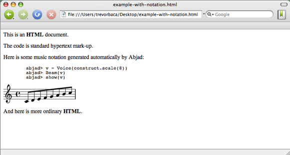

``abjad-book``
==============

``abjad-book`` is an independent application included every installation
of Abjad. ``abjad-book`` allows you to write Abjad code in the middle
of documents written in HTML, LaTeX or ReST. 
We created ``abjad-book`` to help us document Abjad.
Our work on ``abjad-book`` was inspired by ``lilypond-book``,
which does for LilyPond much what ``abjad-book`` does for Abjad.

HTML with embedded Abjad
------------------------

To see ``abjad-book`` in action, open a file and write some HTML by hand.
And add some Abjad code to your HTML between open and close
\<abjad\> \</abjad\> tags.

.. sourcecode:: html

   <html>

   
This is an <b>HTML</b> document.

   
The code is standard hypertext mark-up.

   
Here is some music notation generated automatically by Abjad:

   <ajbad>
   v = Voice(construct.scale(8))
   Beam(v)
   write_ly(v, 'example-1') <hide
   show(v)
   </ajbad>

   
And here is more ordinary <b>HTML</b>.

   </html>

Save your the file with the name ``example.html.raw``. You now have
an HTML file with embedded Abjad code.

Call ``abjad-book`` on ``example.html.raw``. ::

   abjad-book example.html.raw example.html

   Parsing file...
   Rendering "example-1.ly"...
   
The application opens ``example.html.raw``, finds all Abjad code between
\<abjad\> \</abjad\> tags, and then creates and inserts image files
of music notation accordingly.

Open ``example.html`` with your browser.

That's all there is to it. ``abjad-book`` lets you open a file and type
HTML by hand with Abjad sandwiched between the special \<abjad\> \</abjad\>
tags described here. Run ``abjad-book`` on such a hybrid file to create
pure HTML with images of music notation created by Abjad.

Using ``abjad-book`` on other document types
--------------------------------------------

You can call ``abjad-book`` on LaTeX and ReST documents, too.

Examples coming soon.
