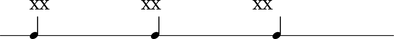
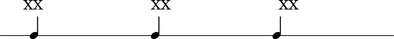
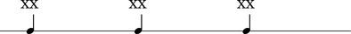
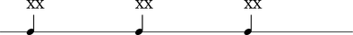
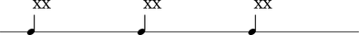

Text alignment
==============

LilyPond provides a bewildering collection of explicit settings, markup
and grob overrides to control the positioning and alignment of text.
The appendix here serves as a visual index of a growing number of the
different ways to align text in LilyPond score.

``TextScript #'self-alignment-X``
---------------------------------

Determines alignment of text relative to left-edge-of-notehead.
These three examples look visibly different and make sense.

::

	abjad> score = Score([RhythmicStaff(construct.run(3, Rational(1, 4)))])
	abjad> leaves = score.leaves
	abjad> leaves[0].markup.up.append('XX')
	abjad> leaves[0].text.self_alignment_X = 'left'
	abjad> leaves[1].markup.up.append('XX')
	abjad> leaves[1].text.self_alignment_X = 'center'
	abjad> leaves[2].markup.up.append('XX')
	abjad> leaves[2].text.self_alignment_X = 'right'
	abjad> show(score, 'thebes')

``TextScript #'X-offset``
-------------------------

.. note:: These three examples just don't make sense. 
   It looks like what's going on here are two things.
   First, the text takes the left-edge-of-notehead as a reference
   point in all three cases.
   Second, the text offets itself by 1 notehead width the left,
   no notehead withds at all, and 1 notehead width to the right,
   for the three examples respectively.
   If that's what's going on, then ``#'X-offset`` values don't
   mean something semantic like 'edge of notehead' but instead
   are just numbers of notehead widths.

::

	abjad> score = Score([RhythmicStaff(construct.run(3, Rational(1, 4)))])
	abjad> leaves = score.leaves
	abjad> leaves[0].markup.up.append('XX')
	abjad> leaves[0].text.X_offset = 'left'
	abjad> leaves[1].markup.up.append('XX')
	abjad> leaves[1].text.X_offset = 'center'
	abjad> leaves[2].markup.up.append('XX')
	abjad> leaves[2].text.X_offset = 'right'
	abjad> show(score, 'thebes')

.. image:: images/X-offset-only.png

Constant ``TextScript #'self-alignment-X``
------------------------------------------

.. note:: The three sets of examples here are all the same!

Left
^^^^

::

	abjad> score = Score([RhythmicStaff(construct.run(3, Rational(1, 4)))])
	abjad> score.text.self_alignment_X = 'left'
	abjad> leaves = score.leaves
	abjad> leaves[0].markup.up.append('XX')
	abjad> leaves[0].text.X_offset = 'left'
	abjad> leaves[1].markup.up.append('XX')
	abjad> leaves[1].text.X_offset = 'center'
	abjad> leaves[2].markup.up.append('XX')
	abjad> leaves[2].text.X_offset = 'right'
	abjad> show(score, 'thebes')

.. image:: images/left-of-notehead.png

Center
^^^^^^

::

	abjad> score = Score([RhythmicStaff(construct.run(3, Rational(1, 4)))])
	abjad> score.text.self_alignment_X = 'center'
	abjad> leaves = score.leaves
	abjad> leaves[0].markup.up.append('XX')
	abjad> leaves[0].text.X_offset = 'left'
	abjad> leaves[1].markup.up.append('XX')
	abjad> leaves[1].text.X_offset = 'center'
	abjad> leaves[2].markup.up.append('XX')
	abjad> leaves[2].text.X_offset = 'right'
	abjad> show(score, 'thebes')

.. image:: images/center-of-notehead.png

Right
^^^^^

::

	abjad> score = Score([RhythmicStaff(construct.run(3, Rational(1, 4)))])
	abjad> score.text.self_alignment_X = 'right'
	abjad> leaves = score.leaves
	abjad> leaves[0].markup.up.append('XX')
	abjad> leaves[0].text.X_offset = 'left'
	abjad> leaves[1].markup.up.append('XX')
	abjad> leaves[1].text.X_offset = 'center'
	abjad> leaves[2].markup.up.append('XX')
	abjad> leaves[2].text.X_offset = 'right'
	abjad> show(score, 'thebes')

Constant ``TextScript #'X-offset``
----------------------------------

Left
^^^^

::

	abjad> score = Score([RhythmicStaff(construct.run(3, Rational(1, 4)))])
	abjad> score.text.X_offset = 'left'
	abjad> leaves = score.leaves
	abjad> leaves[0].markup.up.append('XX')
	abjad> leaves[0].text.self_alignment_X = 'left'
	abjad> leaves[1].markup.up.append('XX')
	abjad> leaves[1].text.self_alignment_X = 'center'
	abjad> leaves[2].markup.up.append('XX')
	abjad> leaves[2].text.self_alignment_X = 'right'
	abjad> show(score, 'thebes')

Center
^^^^^^

::

	abjad> score = Score([RhythmicStaff(construct.run(3, Rational(1, 4)))])
	abjad> score.text.X_offset = 'center'
	abjad> leaves = score.leaves
	abjad> leaves[0].markup.up.append('XX')
	abjad> leaves[0].text.self_alignment_X = 'left'
	abjad> leaves[1].markup.up.append('XX')
	abjad> leaves[1].text.self_alignment_X = 'center'
	abjad> leaves[2].markup.up.append('XX')
	abjad> leaves[2].text.self_alignment_X = 'right'
	abjad> show(score, 'thebes')

Right
^^^^^

::

	abjad> score = Score([RhythmicStaff(construct.run(3, Rational(1, 4)))])
	abjad> score.text.X_offset = 'right'
	abjad> leaves = score.leaves
	abjad> leaves[0].markup.up.append('XX')
	abjad> leaves[0].text.self_alignment_X = 'left'
	abjad> leaves[1].markup.up.append('XX')
	abjad> leaves[1].text.self_alignment_X = 'center'
	abjad> leaves[2].markup.up.append('XX')
	abjad> leaves[2].text.self_alignment_X = 'right'
	abjad> show(score, 'thebes')

