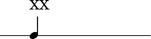
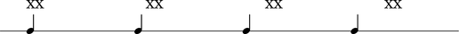

Text alignment
==============

LilyPond provides many different ways to positiong text.
The appendix here outlines some of the most important.

Default alignment
-----------------

LilyPond LEFT aligns markup relative to the LEFT edge-of-notehead by default.

::

	abjad> notes = construct.run(1, Rational(1, 4))
	abjad> staff = RhythmicStaff(notes)
	abjad> leaves = staff.leaves
	abjad> leaves[0].markup.up.append('XX')
	abjad> show(staff, 'thebes')

``TextScript #'self-alignment-X``
---------------------------------

Use ``#'self-alignment-X`` to LEFT-, CENTER- or RIGHT-align markup
relative to the LEFT edge-of-notehead.

.. note:: changes to ``#'self-alignment-X`` do not change the fact
   that markup positioning is by default relative to the 
   LEFT edge-of-notehead.

::

	abjad> notes = construct.run(3, Rational(1, 4))
	abjad> staff = RhythmicStaff(notes)
	abjad> leaves = staff.leaves
	abjad> leaves[0].markup.up.append('XX')
	abjad> leaves[0].text.self_alignment_X = 'left'
	abjad> leaves[1].markup.up.append('XX')
	abjad> leaves[1].text.self_alignment_X = 'center'
	abjad> leaves[2].markup.up.append('XX')
	abjad> leaves[2].text.self_alignment_X = 'right'
	abjad> show(staff, 'thebes')

.. image:: images/self-alignment-X-alone.png

``TextScript #'X-offset``
-------------------------

Use ``#'X-offset`` to OFFSET markup by some number of magic units
in the horizontal direction.

.. note:: Specify ``#'X-offset`` arguments as numbers like ``#2.5``.
   Do not specify ``#'X-offset`` arguments as direction contstants 
   like ``#right``.

.. note:: changes to ``#'X-offset`` do not change the fact
   that markup positioning is by default relative to the 
   LEFT edge-of-notehead.

::

	abjad> notes = construct.run(4, Rational(1, 4))
	abjad> staff = RhythmicStaff(notes)
	abjad> leaves = staff.leaves
	abjad> leaves[0].markup.up.append('XX')
	abjad> leaves[0].text.X_offset = 0
	abjad> leaves[1].markup.up.append('XX')
	abjad> leaves[1].text.X_offset = 2
	abjad> leaves[2].markup.up.append('XX')
	abjad> leaves[2].text.X_offset = 4
	abjad> leaves[3].markup.up.append('XX')
	abjad> leaves[3].text.X_offset = 6
	abjad> show(staff, 'thebes')

