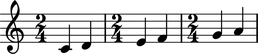

Comment-numbering measures
==========================

Abjad formats the contents of a measure with open and close
curly braces as start and stop delimiters. This helps you see where
measures begin and end in the LilyPond code that make with Abjad.

::

	abjad> staff = Staff(RigidMeasure((2, 4), construct.scale(2, Rational(1, 4))) * 3)
	abjad> pitchtools.diatonicize(staff)
	abjad> print staff.format
	\new Staff {
		{
			\time 2/4
			c'4
			d'4
		}
		{
			\time 2/4
			e'4
			f'4
		}
		{
			\time 2/4
			g'4
			a'4
		}
	}
	abjad> show(staff)

You can use 
:func:`label.measure_numbers() <abjad.tools.label.measure_numbers>` 
to label measure numbers just before and just after each start and 
stop brace. Abjad calls this 'comment numbering' because the labels 
you create here are inserted as comments in your LilyPond code.

::

	abjad> label.measure_numbers(staff)
	abjad> print staff.format
	\new Staff {
		% start measure 1
		{
			\time 2/4
			c'4
			d'4
		}
		% stop measure 1
		% start measure 2
		{
			\time 2/4
			e'4
			f'4
		}
		% stop measure 2
		% start measure 3
		{
			\time 2/4
			g'4
			a'4
		}
		% stop measure 3
	}

Turn comment-numbering off with ``style = None``.

::

	abjad> label.measure_numbers(staff, style = None)
	abjad> print staff.format
	\new Staff {
		{
			\time 2/4
			c'4
			d'4
		}
		{
			\time 2/4
			e'4
			f'4
		}
		{
			\time 2/4
			g'4
			a'4
		}
	}

