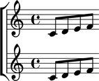
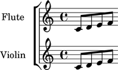

Naming components
=================

You can name any Abjad component.

::

	abjad> flute_staff = Staff(construct.scale(4))
	abjad> flute_staff.name = 'Flute'
	abjad> violin_staff = Staff(construct.scale(4))
	abjad> violin_staff.name = 'Violin'
	abjad> staff_group = StaffGroup([flute_staff, violin_staff])
	abjad> score = Score([staff_group])

Component names make it easy to find components later. ::

   scoretools.find(score, 'Flute')
   [Staff{4}]

Component names do not appear in musical output.

Use the instrument interface to add instrument names.

::

	abjad> flute_staff.instrument.name = 'Flute '
	abjad> violin_staff.instrument.name = 'Violin '

Instrument names do appear in musical output.

