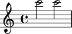
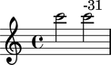

Setting pitch deviation
=======================

Sometimes it is helpful to model the fact that two pitches differ
from each other by a fraction of a semitone. You do this in Abjad
with pitch deviation.

::

	abjad> note_1 = Note(24, (1, 2))
	abjad> note_2 = Note(24, (1, 2))
	abjad> note_2.pitch.deviation = -31

The two notes here are both notated as C6.
But because the second note carries pitch deviation equal to -31 cents,
the pitch of the first note is greater than the pitch
of the second. ::

   note_1.pitch > note_2.pitch
   True

Setting pitch deviation has no notational effect.
If you want to include indications of pitch deviation in your score,
you can do so manually with markup.

::

	abjad> note_2.markup.up.append(note_2.pitch.deviation)

Unset pitch deviation with None. ::

   note_2.pitch.deviation = None
   note_1.pitch == note_2.pitch
   True
