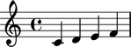
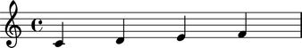

Setting spacing scorewide
-------------------------

You can use the ``SpacingInterface`` to set spacing attributes scorewide.

Here is a score with no explicit spacing.

::

	abjad> score = Score([Staff(construct.scale(4, Rational(1, 4)))])
	abjad> show(score)

Here is the same score with LilyPond's proportional notation turned on.

::

	abjad> score.spacing.proportional_notation_duration = Rational(1, 16)
	abjad> print score.format
	\new Score \with {
		proportionalNotationDuration = #(ly:make-moment 1 16)
	} <<
		\new Staff {
			c'4
			d'4
			e'4
			f'4
		}
	>>

::

	abjad> show(score)

