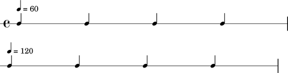
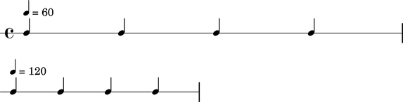

Propotional tempo spanners
==========================

Abjad implements a special proportional tempo spanner.

::

	abjad> staff = RhythmicStaff(construct.run(8, Rational(1, 4)))
	abjad> score = Score([staff])
	abjad> tempo_indication_1 = tempotools.TempoIndication(Rational(1, 4), 60)
	abjad> proportional_tempo_spanner_1 = TempoSpannerProportional(staff[:4], tempo_indication_1)
	abjad> tempo_indication_2 = tempotools.TempoIndication(Rational(1, 4), 120)
	abjad> proportional_tempo_spanner_2 = TempoSpannerProportional(staff[4:], tempo_indication_2)

Proportional tempo spanners insert new spacing sections into LilyPond
input code.

::

	abjad> f(score)
	\new Score <<
		\new RhythmicStaff {
			\tempo 4=60
			\newSpacingSection
			c'4
			c'4
			c'4
			c'4
			%% tempo 4=60 ends here
			\tempo 4=120
			\newSpacingSection
			c'4
			c'4
			c'4
			c'4
			%% tempo 4=120 ends here
		}
	>>

But new spacing sections have no visual effect by themselves.

::

	abjad> show(score)

The first and second measures above space the same way
even though different proportional tempo spanners attach
to the notes in each measure.

Turn on scorewide spacing to see a difference.

::

	abjad> tempo_indication = tempotools.TempoIndication(Rational(1, 4), 60)
	abjad> reference_proportional_notation_duration = Rational(1, 32)
	abjad> scorewide_spacing = spacing.SpacingIndication(tempo_indication, reference_proportional_notation_duration)
	abjad> score.spacing.scorewide = scorewide_spacing
	abjad> f(score)
	\new Score <<
		\new RhythmicStaff {
			\tempo 4=60
			\newSpacingSection
			\set Score.proportionalNotationDuration = #(ly:make-moment 1 32)
			c'4
			c'4
			c'4
			c'4
			%% tempo 4=60 ends here
			\tempo 4=120
			\newSpacingSection
			\set Score.proportionalNotationDuration = #(ly:make-moment 1 16)
			c'4
			c'4
			c'4
			c'4
			%% tempo 4=120 ends here
		}
	>>

Abjad now inserts LilyPond proportional notation settings
at the beginning of each new tempo region.

::

	abjad> show(score)

The first measure above consumes exactly twice the horizontal space
as the second measure because different proportional tempo
spanners attach to the notes in each measure and because scorewide
spacing is turned on.
