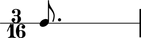
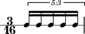

Introduction
============

Abjad publishes information about many **durated** score objects.

Notes, rests, chords and skips carry some duration attributes.

::

	abjad> note = Note(0, (3, 16))
	abjad> measure = RigidMeasure((3, 16), [note])
	abjad> staff = RhythmicStaff([measure])
	abjad> print note.duration.written
	3/16
	

Tuplets, measures, voices, staves and the other containers carry even more.

::

	abjad> tuplet = FixedDurationTuplet((3, 16), Note(0, (1, 16)) * 5)
	abjad> measure = RigidMeasure((3, 16), [tuplet])
	abjad> staff = RhythmicStaff([measure])
	abjad> print tuplet.duration.multiplier
	3/5
	

The next chapters document duration in Abjad and explain core duration concepts.

