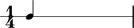
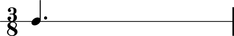
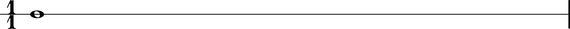

Duration token
==============

Abjad notes, rests, chords, tuplets and other durated components accept duration input in a couple of different formats.

* Abjad :class:`Rational` instances
* Python pairs
* Python `int` and `long` instances

For example:

::

   abjad> note = Note(0, Rational(1, 4))

And:

::

   abjad> note = Note(0, (3, 8))

And:

::

   abjad> note = Note(0, 1)

The Abjad **duration token** generalizes these different types of input.

Examples in the documentation that ask for valid duration token input accept any of the types of input show here.

Comments
--------

Abjad does not count the Python `float` among the valid types of duration token.

