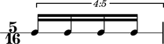

Duration types
==============

Abjad publishes duration information about notes, rests, chords and
skips, and also about tuplets, measures, voices, staves and the other
containers. Abjad groups duration information about notes, rests,
chords and skips into the :class:`_LeafDurationInterface <abjad.leaf.duration._LeafDurationInterface>` class; duration information about tuplets, measures, voices, staves and other
containers groups together inside some type of :class:`_ComponentDurationInterface <abjad.component.duration._ComponentDurationInterface>` interface. 

Written duration
----------------

Abjad uses **written duration** to refer to the face value of notes, rests, chords and skips without prolation. Abjad written duration corresponds to the informal names we use when talking about duration.

The sixteenth notes here are worth exactly a sixteenth of a whole note.

::

	abjad> measure = RigidMeasure((5, 16), Note(0, (1, 16)) * 5)
	abjad> Beam(measure)
	abjad> staff = RhythmicStaff([measure])
	abjad> note = measure[0]
	abjad> print note.duration.written
	1/16

The sixteenth notes here are worth more than a sixteenth of a whole note.

::

	abjad> tuplet = FixedDurationTuplet((5, 16), Note(0, (1, 16)) * 4)
	abjad> Beam(tuplet)
	abjad> measure = RigidMeasure((5, 16), [tuplet])
	abjad> staff = RhythmicStaff([measure])
	abjad> note = tuplet[0]
	abjad> print note.duration.written
	1/16

The notes in these examples carry different durations.
But we probably still call them all sixteenths anyway.
Abjad written duration captures the fact that these notes write the same way before prolation.

Abjad notes, rests, chords and skips all make written duration
available as ``duration.written``. Written duration is a user-assignable
rational number. Users can assign and reassign the written duration of
notes, rests, chords and skips at initialization and at any time
during the life of the note, rest, chord or skip. Notes, rests, chords
and skips admit a degree of input flexibility; Abjad :class:`Rational <abjad.rational.rational.Rational>`
instances, rational tokens, and integers are all allowed; see the
chapter on :doc:`duration initialzation <../initialization/index>` for details. 
Written durations must always be notehead-assignable; see the chapter on
:doc:`assignability <../assignability/index>` for
details. The written duration of notes, rests, chords and skips
corresponds more closely to our usual understanding of musical
duration than do any of the other Abjad duration attributes. Abjad
containers do not carry written duration.

Prolated duration
-----------------

:doc:`Prolation <../prolation/index>` refers to the duration-scaling
effects of tuplets and special types of time signature. Prolation is a
way of thinking about the contribution that musical structure makes to
the duration of score objects. All durated Abjad objects carry a
prolated duration as `duration.prolated`. Prolated duration is an
emergent property of notes, tuplets and other durated objects. The
prolated duration of notes, rests, chords and skips equals the product
of the written duration and prolation of those objects. The prolated
duration of tuplets, measures and other containers equals the product
of the container duration interface itself and the prolation of the
container in question.

.. todo::

   Prolated leaf duration makes perfect sense: written * prolation. But
   prolated container duration is a mess: self * prolation, where self is
   whatever magic value the container duration interface itself carries.
   Clean this in the one remaining duration rewrite. We want duration
   interface comparison of the form ``leaf1.duration == leaf2.duration``
   and ``container1.duration == container2.duration``. But we do not want
   duration interface assignment of the form ``container1.duration = (1,
   8)``. Right now, unfortunately, fixed-duration tuplets demand interface
   assignment when, for example, you want to change the "container size"
   (or whatever it is) of the tuplet in question.

Contents duration
-----------------

Abjad defines the **contents duration** of tuplets, measures, voices, staves and other containers equal to the sum of the **preprolated duration** of each of the elements in the container.

The measure here contains two eighth notes and tuplet. These elements carry preprolated durations equal to 1/8, 1/8 and 2/8, respectively.

::

	abjad> notes = Note(0, (1, 8)) * 2
	abjad> Beam(notes)
	abjad> tuplet = FixedDurationTuplet((2, 8), Note(0, (1, 8)) * 3)
	abjad> Beam(tuplet)
	abjad> measure = RigidMeasure((4, 8), notes + [tuplet]) 
	abjad> staff = RhythmicStaff([measure])
	abjad> print measure.duration.contents
	1/2

The contents duration of the measure here equals 1/8 + 1/8 + 2/8 = 4/8.

Target duration
---------------

Abjad defines the target duration of fixed-duration tuplets equal to composer-settable duration to which the tuplet prolates its contents.

The fixed-duration tuplet here carries a target duration equal to 4/8.

::

	abjad> tuplet = FixedDurationTuplet((4, 8), Note(0, (1, 8)) * 5)
	abjad> Beam(tuplet)
	abjad> measure = RigidMeasure((4, 8), [tuplet]) 
	abjad> staff = RhythmicStaff([measure])
	abjad> print tuplet.duration.contents
	5/8
	abjad> print tuplet.duration.target
	1/2

.. image:: images/target_dur1.png

The tuplet contents sum to 5/8. But tuplet target duration always equals 4/8.

Multiplied duration
-------------------

Abjad defines the multiplied duration of notes, rests, chords and skips equal to the product of written duration and leaf multiplier.

The first two notes here carry leaf mulitipliers equal to 2/1.

::

	abjad> notes = Note(0, (1, 16)) * 4
	abjad> notes[0].duration.multiplier = Rational(2, 1)
	abjad> notes[1].duration.multiplier = Rational(2, 1)
	abjad> measure = RigidMeasure((3, 8), notes) 
	abjad> Beam(measure)
	abjad> staff = RhythmicStaff([measure])
	abjad> note = measure[0]
	abjad> print note.duration.written
	1/16

::

	abjad> print note.duration.multiplier
	2

::

	abjad> print note.duration.written * note.duration.multiplier
	1/8
	abjad> print note.duration.multiplied
	1/8

The written duration of these first two notes equals 1/16 and so the multiplied duration of these first two notes equals 1/16 * 2/1 = 1/8.

