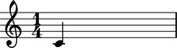
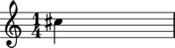

Pitch token
===========

Abjad notes and chords accept all of the following as pitch input:

#. Python `int` and `long` instances
#. Python `float` instances
#. Abjad :class:`Pitch <abjad.pitch.pitch.Pitch>` instances

For example:

::

	abjad> note = Note(0, (1, 4))
	

And:

::

	abjad> note = Note(5.5, (1, 4))
	

.. image:: images/pitch_token2.png

And:

::

	abjad> note = Note(Pitch(13), (1, 4))
	

The Abjad **pitch token** generalizes these four types of input.

Examples in the documentation that ask for valid pitch token input accept any of the types of input show here.

.. note::

   Abjad accepts only those ``float`` instances evenly divisible by `0.5` as valid pitch token instances because Abjad implements accidental drawing symbols to the level of the quartertone only.

