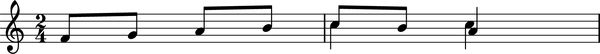

Threads
=======

What is a thread?
-----------------

Abjad has the notion of a :term:`thread`. A thread is a structural relationship binding a set of strictly sequential :class:`~abjad.voice.voice.Voice` level Abjad component, such as notes, rests, chords, tuplets or plain containers.

Threads may be *explicitly* defined via :class:`~abjad.voice.voice.Voice` instances: 

::

	abjad> v = Voice( )

or they may exist *implicitly* in certain score constructs in the absence of :class:`~abjad.voice.voice.Voice` containers:

::

	abjad> staff = Staff(construct.scale(4))

The existence of :class:`~abjad.voice.voice.Voice` objects does not, however, guarantee the existence of a thread between the element contained in different voices. Two contiguous voices *must* have the same name in order to be part of the same thread. 

Here a thread does *not* exist between notes in the different :class:`~abjad.voice.voice.Voice` contexts:

::

	abjad> v_one = Voice(construct.scale(4, (1, 16)))
	abjad> v_two = Voice(construct.scale(2))
	abjad> staff = Staff([v_one, v_two])
	abjad> f(staff)
	\new Staff {
		\new Voice {
			c'16
			d'16
			e'16
			f'16
		}
		\new Voice {
			c'8
			d'8
		}
	}

Here a thread does exist:

::

	abjad> v_one.name = 'flute'
	abjad> v_two.name = 'flute'
	abjad> f(staff)
	\new Staff {
		\context Voice = "flute" {
			c'16
			d'16
			e'16
			f'16
		}
		\context Voice = "flute" {
			c'8
			d'8
		}
	}

What are threads for?
---------------------

Consider the following situation:

Are the two eighth notes in the second measure the continuation of the ascending line in the first measure, or is it the quarter note? The stem might suggest an answer, but the same question can be asked for the two quarter notes in the second half of measure two. Is the *C* the continuation of the top melodic line or is it the *A*?  
What path should Abjad take to traverse this little score from the first note to the last *A*? This same problem appears when trying to apply spanners to parallel structures.  Thus, threads are important in both score navigation (also called score traversal) and :class:`~abjad.spanner.spanner.Spanner` application.
In fact, threads are a *requirement* for :class:`~abjad.spanner.spanner.Spanner` application (See the chapter in :doc:`/chapters/spanners/index` for an introduction to spanners). 

In Abjad, the ambiguity is resolved through the explicit use of named Voices, i.e. the explicit definition of threads. 

