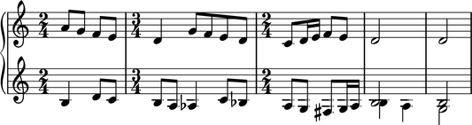
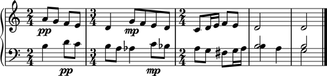
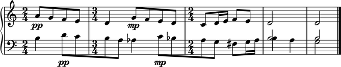
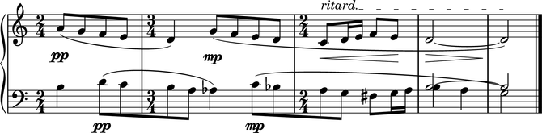

Bartók: *Mikrokosmos*
=====================

This example reconstructs the last five measures of Bartók's "Wandering"
from *Mikrokosmos*, volume III.  
The end result is just a few measures long but covers the basic features 
you'll use most often in Abjad.

Here is what we want to end up with:

.. image :: images/bartok-final.png

The score
---------

We'll construct the fragment top-down from containers to notes.
We could have done it the other way around but it will be easier to keep the big picture 
in mind this way. Later, you can rebuild the example bottom-up as an exercise.

First let's create an empty score with a pair of staves connected by a brace:

::

   >>> score = Score([])
   >>> piano_staff = scoretools.PianoStaff([])
   >>> upper_staff = Staff([])
   >>> lower_staff = Staff([])

::

   >>> piano_staff.append(upper_staff)
   >>> piano_staff.append(lower_staff)
   >>> score.append(piano_staff)

Here we create an empty score and assign it to the ``score`` variable.
Then we create an empty piano staff assigned to the ``piano_staff`` variable and
two empty staves assigned to the ``upper_staff`` and ``lower_staff`` variables.
Finally, we append the two staves to the piano staff and the piano staff to the score.

The measures
------------

Now let's add some measures to our score:

::

   >>> m1 = Measure((2, 4), [])
   >>> m2 = Measure((3, 4), [])
   >>> m3 = Measure((2, 4), [])
   >>> m4 = Measure((2, 4), [])
   >>> m5 = Measure((2, 4), [])

::

   >>> upper_measures = [m1, m2, m3, m4, m5]
   >>> lower_measures = componenttools.copy_components_and_covered_spanners(upper_measures)

::

   >>> upper_staff.extend(upper_measures)
   >>> lower_staff.extend(lower_measures)

The lower measures are copies of the upper measures.

Note that we add lists of measures to staves with ``extend()``.
This is because ``extend()`` is used for adding many objects to an iterable at once
while ``append()`` is used to add only one object at a time.

The notes
---------

Now let's add some notes. We begin with the upper staff:

::

   >>> upper_measures[0].extend([Note(i, (1, 8)) for i in [9, 7, 5, 4]])

::

   >>> upper_measures[1].extend(notetools.make_notes([2, 7, 5, 4, 2], [(1, 4)] + [(1, 8)] * 4))

::

   >>> notes = notetools.make_notes([0, 2, 4, 5, 4], [(1, 8), (1, 16), (1, 16), (1, 8), (1, 8)])
   >>> upper_measures[2].extend(notes)

::

   >>> upper_measures[3].append(Note("d'2"))

::

   >>> upper_measures[4].append(Note("d'2"))

Now let's add notes to the lower staff. 
This will be a more intricate process than that needed for the upper staff. 
We added notes directly to the measures of the upper staff.
But this will not be possible for the lower staff because of the simultaneous voices
the lower staff contains.

We add notes to the lower staff measure by measure:

::

   >>> main_voice_m1 = Voice("b4 d'8 c'8")
   >>> main_voice_m1.name = 'main_voice'
   >>> lower_measures[0].append(main_voice_m1)

::

   >>> main_voice_m2 = Voice("b8 a8 af4 c'8 bf8")
   >>> main_voice_m2.name = 'main_voice'
   >>> lower_measures[1].append(main_voice_m2)

::

   >>> main_voice_m3 = Voice("a8 g8 fs8 g16 a16")
   >>> main_voice_m3.name = 'main_voice'
   >>> lower_measures[2].append(main_voice_m3)

Notice that we give the same name to the three voices contained in 
the first three measures of the lower staff.

It is in the last two measures of the lower staff where Bartók writes two voices at once.
We'll name the second of these two voices the `appendix_voice`:

::

   >>> appendix_voice_m4 = Voice([Note("b2")])
   >>> appendix_voice_m4.name = 'appendix_voice'
   >>> lilypond_command_mark = marktools.LilyPondCommandMark('voiceOne')
   >>> lilypond_command_mark.attach(appendix_voice_m4)
   LilyPondCommandMark('voiceOne')(Voice-"appendix_voice"{1})

::

   >>> main_voice_m4 = Voice("b4 a4")
   >>> main_voice_m4.name = 'main_voice'
   >>> lilypond_command_mark = marktools.LilyPondCommandMark('voiceTwo')
   >>> lilypond_command_mark.attach(main_voice_m4)
   LilyPondCommandMark('voiceTwo')(Voice-"main_voice"{2})

::

   >>> container = Container([appendix_voice_m4, main_voice_m4])
   >>> container.is_parallel = True
   >>> lower_measures[3].append(container)

The LilyPond ``\voiceOne`` and ``\voiceTwo`` commands determine the direction
of the stems in different voices.

Note that we must put both voices in a parallel container 
because they occur at the same time in the score.
We do this by creating an Abjad container and then setting 
the ``is_parallel`` attribute of the container to true.

We now do a similar thing for the last measure:

::

   >>> appendix_voice_m5 = Voice("b2")
   >>> appendix_voice_m5.name = 'appendix_voice'
   >>> lilypond_command_mark = marktools.LilyPondCommandMark('voiceOne')
   >>> lilypond_command_mark.attach(appendix_voice_m5)
   LilyPondCommandMark('voiceOne')(Voice-"appendix_voice"{1})

::

   >>> main_voice_m5 =  Voice("g2")
   >>> main_voice_m5.name = 'main_voice'
   >>> lilypond_command_mark = marktools.LilyPondCommandMark('voiceTwo')
   >>> lilypond_command_mark.attach(main_voice_m5)
   LilyPondCommandMark('voiceTwo')(Voice-"main_voice"{1})

::

   >>> container = Container([appendix_voice_m5, main_voice_m5])
   >>> container.is_parallel = True
   >>> lower_measures[4].append(container)

Here's our work so far:

::

   >>> show(score)

The details
-----------

Ok, let's add the details.
First, notice that the bottom staff has a treble clef just like the top staff.
Let's change that:

::

   >>> contexttools.ClefMark('bass')(lower_staff)
   ClefMark('bass')(Staff{5})

Now let's add dynamic marks.
For the top staff, we'll add them to the first note of the first measure
and the second note of the second measure.
For the bottom staff, we'll add dynamic markings to the second note
of the first measure and the fourth note of the second measure.

::

   >>> contexttools.DynamicMark('pp')(upper_measures[0][0])
   DynamicMark('pp')(a'8)
   >>> contexttools.DynamicMark('mp')(upper_measures[1][1])
   DynamicMark('mp')(g'8)
   >>> contexttools.DynamicMark('pp')(lower_measures[0][0][1])
   DynamicMark('pp')(d'8)
   >>> contexttools.DynamicMark('mp')(lower_measures[1][0][3])
   DynamicMark('mp')(c'8)

Let's add a double bar to the end of the piece:

::

   >>> bar_line = marktools.BarLine('|.')
   >>> bar_line.attach(lower_staff.leaves[-1])
   BarLine('|.')(g2)

And see how things are coming out:

::

   >>> show(score)

Notice that the beams of the eighth and sixteenth notes appear 
as you would usually expect: grouped by beat.
We get this for free thanks to LilyPond's default beaming algorithm.
But this is not the way Bartók notated the beams.
Let's set the beams as Bartók did with some crossing the bar lines:

::

   >>> beamtools.BeamSpanner(upper_measures[0])
   BeamSpanner(|2/4(4)|)
   >>> beamtools.BeamSpanner(lower_staff.leaves[1:5])
   BeamSpanner(d'8, c'8, b8, a8)
   >>> beamtools.BeamSpanner(lower_staff.leaves[6:10])
   BeamSpanner(c'8, bf8, a8, g8)

::

   >>> show(score)

Now some slurs:

::

   >>> spannertools.SlurSpanner(upper_staff.leaves[0:5])
   SlurSpanner(a'8, g'8, f'8, e'8, d'4)
   >>> spannertools.SlurSpanner(upper_staff.leaves[5:])
   SlurSpanner(g'8, f'8, ... [7] ..., d'2, d'2)
   >>> spannertools.SlurSpanner(lower_staff.leaves[1:6])
   SlurSpanner(d'8, c'8, b8, a8, af4)
   >>> spannertools.SlurSpanner(lower_staff.leaves[6:13] + (main_voice_m4, main_voice_m5))
   SlurSpanner(c'8, bf8, ... [5] ..., {b4, a4}, {g2})

Hairpins:

::

   >>> spannertools.CrescendoSpanner(upper_staff.leaves[-7:-2])
   CrescendoSpanner(c'8, d'16, e'16, f'8, e'8)
   >>> spannertools.DecrescendoSpanner(upper_staff.leaves[-2:])
   DecrescendoSpanner(d'2, d'2)

A ritardando marking above the last seven notes of the upper staff:

::

   >>> text_spanner = spannertools.TextSpanner(upper_staff.leaves[-7:])
   >>> text_spanner.override.text_spanner.bound_details__left__text = markuptools.Markup('ritard.')

And ties connecting the last two notes in each staff:

::

   >>> tietools.TieSpanner(upper_staff[-2:])
   TieSpanner(|2/4(1)|, |2/4(1)|)
   >>> tietools.TieSpanner([appendix_voice_m4[0], appendix_voice_m5[0]])
   TieSpanner(b2, b2)

The final result:

::

   >>> show(score)

