Containers
==========

Creating containers
-------------------

Create a container with components:

::

	>>> container = Container([Note("ds'16"), Note("cs'16"), Note("e'16"), Note("c'16")])

::

	>>> show(container)

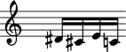

Or with a note-entry string:

.. Xenakis: Jalons (1986): Contrabass: m58

::

	>>> container = Container("ds'16 cs'16 e'16 c'16 d'2 ~ d'8")

::

	>>> show(container)

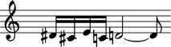

Inspecting music
----------------

Return the components in a container with ``music``:

::

	>>> container.music
	(Note("ds'16"), Note("cs'16"), Note("e'16"), Note("c'16"), Note("d'2"), Note("d'8"))

Or with a special call to ``__getslice__``:

::

	>>> container[:]
	[Note("ds'16"), Note("cs'16"), Note("e'16"), Note("c'16"), Note("d'2"), Note("d'8")]

Inspecting length
-----------------

Get the length of a container with ``len()``:

::

	>>> len(container)
	6

Inspecting duration
-------------------

Contents duration equals the sum of the duration of everything inside the container:

::

	>>> container.contents_duration
	Duration(7, 8)

Adding one component to the end of a container
----------------------------------------------

Add one component to the end of a container with ``append``:

::

	>>> container.append(Note("af'32"))

::

	>>> show(container)

.. image:: images/containers-3.png

Adding many components to the end of a container
------------------------------------------------

Add many components to the end of a container with ``extend``:

::

	>>> container.extend([Note("c''32"), Note("a'32")])

::

	>>> show(container)

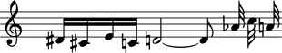

Finding the index of a component
--------------------------------

Find the index of a component with ``index``:

::

	>>> note = container[7]

::

	>>> container.index(note)
	7

Inserting a component by index
------------------------------

Insert a component by index with ``insert``:

::

	>>> container.insert(-3, Note("g'32"))

::

	>>> show(container)

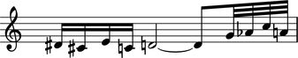

Removing a component by index
-----------------------------

Remove a component by index with ``pop``:

::

	>>> container.pop(-1)

::

	>>> show(container)

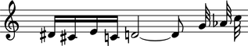

Removing a component by reference
---------------------------------

Remove a component by reference with ``remove``:

::

	>>> container.remove(container[-1])

::

	>>> show(container)

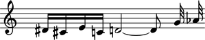

.. note::

    ``__getslice__``, ``__setslice__`` and ``__delslice__`` remain to be documented.

Naming containers
-----------------

You can name Abjad containers:

::

	>>> flute_staff = Staff("c'8 d'8 e'8 f'8")
	>>> flute_staff.name = 'Flute'
	>>> violin_staff = Staff("c'8 d'8 e'8 f'8")
	>>> violin_staff.name = 'Violin'
	>>> staff_group = scoretools.StaffGroup([flute_staff, violin_staff])
	>>> score = Score([staff_group])

Container names appear in LilyPond input:

::

	>>> f(score)
	\new Score <<
		\new StaffGroup <<
			\context Staff = "Flute" {
				c'8
				d'8
				e'8
				f'8
			}
			\context Staff = "Violin" {
				c'8
				d'8
				e'8
				f'8
			}
		>>
	>>

And make it easy to retrieve containers later:

::

	>>> componenttools.get_first_component_in_expr_with_name(score, 'Flute')
	Staff-"Flute"{4}

But container names do not appear in notational output:

::

	>>> show(score)

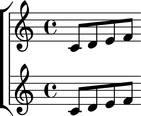

Understanding ``{ }`` and ``<< >>`` in LilyPond
-----------------------------------------------

LilyPond uses curly ``{ }`` braces to wrap a stream of musical events
that are to be engraved one after the other::

    \new Voice {
        e''4
        f''4
        g''4
        g''4
        f''4
        e''4
        d''4
        d''4 \fermata
    }

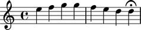

LilyPond uses skeleton ``<< >>`` braces to wrap two or more musical
expressions that are to be played at the same time::

    \new Staff <<
        \new Voice {
            \voiceOne
            e''4
            f''4
            g''4
            g''4
            f''4
            e''4
            d''4
            d''4 \fermata
        }
        \new Voice {
            \voiceTwo
            c''4
            c''4
            b'4
            c''4
            c''8
            b'8
            c''4
            b'4
            b'4 \fermata
        }
    >>

.. image:: images/containers-10.png

The examples above are both LilyPond input.

The most common use of LilyPond ``{ }`` is to group a potentially long stream of notes
and rests into a single expression.

The most common use of LilyPond ``<< >>`` is to group a relatively smaller
number of note lists together polyphonically.

Understanding sequential and parallel containers
------------------------------------------------

Abjad implements LilyPond ``{ }`` and ``<< >>`` in the container ``is_parallel`` attribute.

Some containers set ``is_parallel`` to false at initialization::

    staff = Staff([])
    staff.is_parallel
    False

Other containers set ``is_parallel`` to true::

    score = Score([])
    score.is_parallel
    True

Changing sequential and parallel containers
-------------------------------------------

Set ``is_parallel`` by hand as necessary:

::

	voice_1 = Voice(r"e''4 f''4 g''4 g''4 f''4 e''4 d''4 d''4 ermata")
	voice_2 = Voice(r"c''4 c''4 b'4 c''4 c''8 b'8 c''4 b'4 b'4 ermata")
	>>> staff = Staff([voice_1, voice_2])
	>>> staff.is_parallel = True
	>>> marktools.LilyPondCommandMark('voiceOne')(voice_1)
	>>> marktools.LilyPondCommandMark('voiceTwo')(voice_2)
	>>> show(staff)

.. image:: images/containers-11.png

The staff in the example above is set to parallel after initialization to create
a type of polyphonic staff:

::

	>>> f(staff)
	\new Staff <<
		\new Voice {
			\voiceOne
			e''4
			f''4
			g''4
			g''4
			f''4
			e''4
			d''4
			d''4 -\fermata
		}
		\new Voice {
			\voiceTwo
			c''4
			c''4
			b'4
			c''4
			c''8
			b'8
			c''4
			b'4
			b'4 -\fermata
		}
	>>

Overriding containers
---------------------

The symbols below are black with fixed thickness and predetermined spacing:

::

	>>> staff = Staff("c'4 d'4 e'4 f'4 g'4 a'4 g'2")
	>>> slur_1 = spannertools.SlurSpanner(staff[:2])
	>>> slur_2 = spannertools.SlurSpanner(staff[2:4])
	>>> slur_3 = spannertools.SlurSpanner(staff[4:6])

::

	>>> f(staff)
	\new Staff {
		c'4 (
		d'4 )
		e'4 (
		f'4 )
		g'4 (
		a'4 )
		g'2
	}

::

	>>> show(staff)

.. image:: images/containers-12.png

But you can override LilyPond grobs to change the look of Abjad containers:

::

	>>> staff.override.staff_symbol.color = 'blue'

::

	>>> f(staff)
	\new Staff \with {
		\override StaffSymbol #'color = #blue
	} {
		c'4 (
		d'4 )
		e'4 (
		f'4 )
		g'4 (
		a'4 )
		g'2
	}

::

	>>> show(staff)

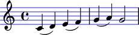

Overriding containers' contents
-------------------------------

You can override LilyPond grobs to change the look of containers' contents, too:

::

	>>> staff.override.note_head.color = 'red'
	>>> staff.override.stem.color = 'red'

::

	>>> f(staff)
	\new Staff \with {
		\override NoteHead #'color = #red
		\override StaffSymbol #'color = #blue
		\override Stem #'color = #red
	} {
		c'4 (
		d'4 )
		e'4 (
		f'4 )
		g'4 (
		a'4 )
		g'2
	}

::

	>>> show(staff)

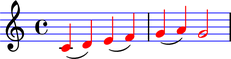

Removing container overrides
----------------------------

Delete grob overrides you no longer want:

::

	>>> del(staff.override.staff_symbol)

::

	>>> f(staff)
	\new Staff \with {
		\override NoteHead #'color = #red
		\override Stem #'color = #red
	} {
		c'4 (
		d'4 )
		e'4 (
		f'4 )
		g'4 (
		a'4 )
		g'2
	}

::

	>>> show(staff)

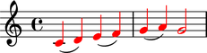
