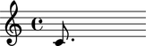
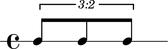
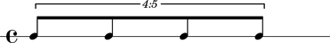
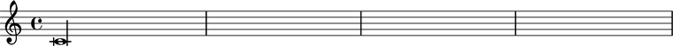

Duration initialization
=======================

Durated Abjad classes initialize duration from arguments in the form `(n, d)` with numerator `n` and denominator `d`.

::

	>>> note = Note("c'8.")

::

	>>> show(note, docs=True)

Durated classes include notes, rests, chords, skips, tuplets and measures.

::

	>>> tuplet = tuplettools.Tuplet((2, 3), "c'8 c'8 c'8")
	>>> beamtools.BeamSpanner(tuplet)
	>>> staff = stafftools.RhythmicStaff([tuplet])

::

	>>> show(staff, docs=True)

Abjad restricts notes, rests, chords and skips to durations like ``3/16`` that can be written 
with dots, beams and flags without ties or brackets. 
Abjad allows arbitrary positive durations like ``5/8`` for tuplets and measures.

::

	>>> tuplet = tuplettools.Tuplet((5, 4), "c'8 c'8 c'8 c'8")
	>>> beamtools.BeamSpanner(tuplet)
	>>> staff = stafftools.RhythmicStaff([tuplet])

::

	>>> show(staff, docs=True)

Abjad supports breves.

::

	>>> note = Note(0, (2, 1))

::

	>>> show(note, docs=True)

And longas.

::

	>>> note = Note(0, (4, 1))

::

	>>> show(note, docs=True)

.. note::

    The restriction that the written durations of notes, rests, chords and skips be expressible with some combination of dots, flags and beams without recourse to ties and brackets generalizes to the condition of note_head assignability. Values `(n, d)` are note_head-assignable when and only when (1) d is a nonnegative integer power of 2; (2) n is either a nonnegative integer power of 2 or is a nonnegative integer power of 2, minus 1; and (3) n/d is less than or equal to 8. Condition (3) captures the fact that LilyPond provides no glyph with greater duration than the maxima (equal to eight whole notes).

.. note::

    Integer forms like ``4`` as a substitute for ``(4, 1)`` in ``Note(0, (4, 1))`` 
    are undocumented but allowed.

.. note::

    Abjad allows maxima note heads as in ``Note(0, (8, 1))``. 
    LilyPond implements a ``\maxima`` command but does not supply a corresponding 
    glyph for the note head.
