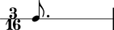
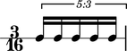

Introduction
============

Abjad publishes information about many durated score objects.

Notes, rests, chords and skips carry some duration attributes:

::

   >>> note = Note(0, (3, 16))
   >>> measure = Measure((3, 16), [note])
   >>> staff = stafftools.RhythmicStaff([measure])

::

   >>> show(staff, docs=True)

::

   >>> note.written_duration
   Duration(3, 16)

Tuplets, measures, voices, staves and the other containers carry duration attributes, too:

::

   >>> tuplet = tuplettools.FixedDurationTuplet(Duration(3, 16), "c'16 c' c' c' c'")
   >>> measure = Measure((3, 16), [tuplet])
   >>> staff = stafftools.RhythmicStaff([measure])

::

   >>> show(staff, docs=True)

::

   >>> tuplet.multiplier
   Fraction(3, 5)

The next chapters document core duration concepts in Abjad.
