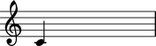
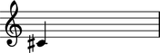
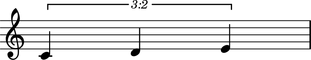
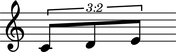
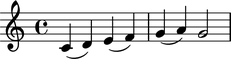
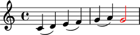
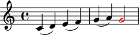

Notes
=====

Making notes from a string
--------------------------

You can make notes from string:

::

	>>> note = Note("c'4")

::

	>>> show(note, docs=True)

.. image:: images/notes-1.png

Making notes from chromatic pitch number and duration
-----------------------------------------------------

You can also make notes from chromatic pitch number and duration:

::

	>>> note = Note(0, Duration(1, 4))

::

	>>> show(note, docs=True)

(You even use ``Note("c'4")`` to create notes with numbers alone.)

Getting the written pitch of notes
----------------------------------

You can get the written pitch of notes:

::

	>>> note.written_pitch
	NamedChromaticPitch("c'")

Changing the written pitch of notes
-----------------------------------

And you can change the written pitch of notes:

::

	>>> note.written_pitch = "cs'"

(You can use ``note.written_pitch = 1`` to change pitch with numbers, too.)

Getting the duration attributes of notes
----------------------------------------

Get the written duration of notes like this:

::

	>>> note.written_duration
	Duration(1, 4)

Which is usually the same as preprolated duration:

::

	>>> note.preprolated_duration
	Duration(1, 4)

And prolated duration:

::

	>>> note.prolated_duration
	Duration(1, 4)

Except for notes inside a tuplet:

::

	>>> tuplet = Tuplet(Fraction(2, 3), [Note("c'4"), Note("d'4"), Note("e'4")])

::

	>>> show(tuplet, docs=True)

::

	>>> note = tuplet[0]

Tupletted notes carry written duration:

::

	>>> note.written_duration
	Duration(1, 4)

Prolation:

::

	>>> note.prolation
	Fraction(2, 3)

And prolated duration that is the product of the two:

::

	>>> note.prolated_duration
	Duration(1, 6)

Changing the written duration of notes
--------------------------------------

You can change the written duration of notes:

::

	>>> tuplet[0].written_duration = Duration(1, 8)
	>>> tuplet[1].written_duration = Duration(1, 8)
	>>> tuplet[2].written_duration = Duration(1, 8)

::

	>>> show(tuplet, docs=True)

Other duration attributes are read-only.

Overriding notes
----------------

The notes below are black with fixed thickness and predetermined spacing:

::

	>>> staff = Staff("c'4 d'4 e'4 f'4 g'4 a'4 g'2")
	>>> slur_1 = spannertools.SlurSpanner(staff[:2])
	>>> slur_2 = spannertools.SlurSpanner(staff[2:4])
	>>> slur_3 = spannertools.SlurSpanner(staff[4:6])

::

	>>> f(staff)
	\new Staff {
		c'4 (
		d'4 )
		e'4 (
		f'4 )
		g'4 (
		a'4 )
		g'2
	}

::

	>>> show(staff)

But you can override LilyPond grobs to change the look of notes, rests and chords:

::

	>>> staff[-1].override.note_head.color = 'red'
	>>> staff[-1].override.stem.color = 'red'

::

	>>> f(staff)
	\new Staff {
		c'4 (
		d'4 )
		e'4 (
		f'4 )
		g'4 (
		a'4 )
		\once \override NoteHead #'color = #red
		\once \override Stem #'color = #red
		g'2
	}

::

	>>> show(staff)

Removing note overrides
-----------------------

Delete grob overrides you no longer want:

::

	>>> del(staff[-1].override.stem)

::

	>>> f(staff)
	\new Staff {
		c'4 (
		d'4 )
		e'4 (
		f'4 )
		g'4 (
		a'4 )
		\once \override NoteHead #'color = #red
		g'2
	}

::

	>>> show(staff)

