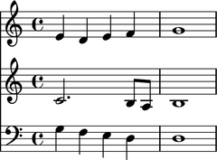
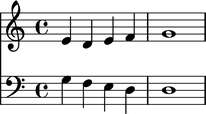
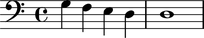

Scores
======

Creating scores
---------------

Create a score like this:

::

	>>> treble_staff_1 = Staff("e'4 d'4 e'4 f'4 g'1")
	>>> treble_staff_2 = Staff("c'2. b8 a8 b1")

::

	>>> score = Score([treble_staff_1, treble_staff_2])

::

	>>> show(score)

.. image:: images/scores-1.png

Inspecting score music
----------------------

Return score components with ``music``:

::

	>>> score.music
	(Staff{5}, Staff{4})

Inspecting score length
-----------------------

Get score length with ``len()``:

::

	>>> len(score)
	2

Inspecting score duration
-------------------------

Score contents duration is equal to the duration of the longest component in score:

::

	>>> score.contents_duration
	Duration(2, 1)

Adding one component to the bottom of a score
---------------------------------------------

Add one component to the bottom of a score with ``append``:

::

	>>> bass_staff = Staff("g4 f4 e4 d4 d1")
	>>> contexttools.ClefMark('bass')(bass_staff)

::

	>>> score.append(bass_staff)

::

	>>> show(score)

Finding the index of a score component
--------------------------------------

Find the index of a score component with ``index``:

::

	>>> score.index(treble_staff_1)
	0

Removing a score component by index
-----------------------------------

Use ``pop`` to remove a score component by index:

::

	>>> score.pop(1)

::

	>>> show(score)

Removing a score component by reference
---------------------------------------

Remove a score component by reference with ``remove``:

::

	>>> score.remove(treble_staff_1)

::

	>>> show(score)

Testing score containment
-------------------------

Use ``in`` to find out whether a score contains a given component:

::

	>>> treble_staff_1 in score
	False

::

	>>> treble_staff_2 in score
	False

::

	>>> bass_staff in score
	True

Naming scores
-------------

You can name Abjad scores:

::

	>>> score.name = 'Example Score'

Score names appear in LilyPond input:

::

	>>> f(score)
	\context Score = "Example Score" <<
		\new Staff {
			\clef "bass"
			g4
			f4
			e4
			d4
			d1
		}
	>>

But do not appear in notational output:

::

	>>> show(score)

.. image:: images/scores-5.png
