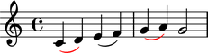
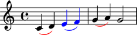
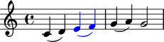

Spanners
========

Overriding spanners
-------------------

The symbols below are black with fixed thickness and predetermined spacing:

::

	>>> staff = Staff("c'4 d'4 e'4 f'4 g'4 a'4 g'2")
	>>> slur_1 = spannertools.SlurSpanner(staff[:2])
	>>> slur_2 = spannertools.SlurSpanner(staff[2:4])
	>>> slur_3 = spannertools.SlurSpanner(staff[4:6])

::

	>>> f(staff)
	\new Staff {
		c'4 (
		d'4 )
		e'4 (
		f'4 )
		g'4 (
		a'4 )
		g'2
	}

::

	>>> show(staff)

.. image:: images/spanners-1.png

But you can override LilyPond grobs to change the look of spanners:

::

	>>> slur_1.override.slur.color = 'red'
	>>> slur_3.override.slur.color = 'red'

::

	>>> f(staff)
	\new Staff {
		\override Slur #'color = #red
		c'4 (
		d'4 )
		\revert Slur #'color
		e'4 (
		f'4 )
		\override Slur #'color = #red
		g'4 (
		a'4 )
		\revert Slur #'color
		g'2
	}

::

	>>> show(staff)

Overriding the components to which spanners attach
--------------------------------------------------

You can override LilyPond grobs to change spanners' contents:

::

	>>> slur_2.override.slur.color = 'blue'
	>>> slur_2.override.note_head.color = 'blue'
	>>> slur_2.override.stem.color = 'blue'

::

	>>> f(staff)
	\new Staff {
		\override Slur #'color = #red
		c'4 (
		d'4 )
		\revert Slur #'color
		\override NoteHead #'color = #blue
		\override Slur #'color = #blue
		\override Stem #'color = #blue
		e'4 (
		f'4 )
		\revert NoteHead #'color
		\revert Slur #'color
		\revert Stem #'color
		\override Slur #'color = #red
		g'4 (
		a'4 )
		\revert Slur #'color
		g'2
	}

::

	>>> show(staff)

Removing spanner overrides
--------------------------

Delete grob overrides you no longer want:

::

	>>> del(slur_1.override.slur)
	>>> del(slur_3.override.slur)

::

	>>> f(staff)
	\new Staff {
		c'4 (
		d'4 )
		\override NoteHead #'color = #blue
		\override Slur #'color = #blue
		\override Stem #'color = #blue
		e'4 (
		f'4 )
		\revert NoteHead #'color
		\revert Slur #'color
		\revert Stem #'color
		g'4 (
		a'4 )
		g'2
	}

::

	>>> show(staff)

