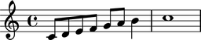
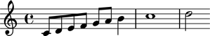
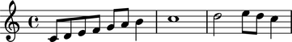
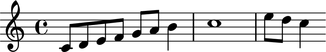
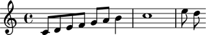

Staves
======

Creating staves
---------------

Create staves like this:

::

	>>> staff = Staff("c'8 d'8 e'8 f'8 g'8 a'8 b'4 c''1")

::

	>>> show(staff)

Inspecting staff music
----------------------

Return staff components with ``music``:

::

	>>> staff.music
	(Note("c'8"), Note("d'8"), Note("e'8"), Note("f'8"), Note("g'8"), Note("a'8"), Note("b'4"), Note("c''1"))

Inspecting staff length
-----------------------

Get staff length with ``len()``:

::

	>>> len(staff)
	8

Inspecting staff duration
-------------------------

Staff contents durations equals the sum of staff components' duration:

::

	>>> staff.contents_duration
	Duration(2, 1)

Adding one component to the end of a staff
------------------------------------------

Add one component to the end of a staff with ``append``:

::

	>>> staff.append(Note("d''2"))

::

	>>> show(staff)

Adding many components to the end of a staff
--------------------------------------------

Add many components to the end of a staff with ``extend``:

::

	>>> notes = [Note("e''8"), Note("d''8"), Note("c''4")]
	>>> staff.extend(notes)

::

	>>> show(staff)

Finding the index of a staff component
--------------------------------------

Find staff component index with ``index``:

::

	>>> notes[0]
	Note("e''8")

::

	>>> staff.index(notes[0])
	9

Removing a staff component by index
-----------------------------------

Use ``pop`` to remove a staff component by index:

::

	>>> staff[8]
	Note("d''2")

::

	>>> staff.pop(8)

::

	>>> show(staff)

Removing a staff component by reference
---------------------------------------

Remove staff components by reference with ``remove``:

::

	>>> staff.remove(staff[-1])

::

	>>> show(staff)

.. image:: images/staves-5.png

Naming staves
-------------

You can name Abjad staves:

::

	>>> staff.name = 'Example Staff'

Staff names appear in LilyPond input:

::

	>>> f(staff)
	\context Staff = "Example Staff" {
		c'8
		d'8
		e'8
		f'8
		g'8
		a'8
		b'4
		c''1
		e''8
		d''8
	}

But not in notational output:

::

	>>> show(staff)

Forcing context
---------------

Staff context equals ``'Staff'`` by default:

::

	>>> staff.context
	'Staff'

You can force staff context:

::

	>>> staff.context = 'CustomUserStaff'

::

	>>> staff.context
	'CustomUserStaff'

::

	>>> f(staff)
	\context CustomUserStaff = "Example Staff" {
		c'8
		d'8
		e'8
		f'8
		g'8
		a'8
		b'4
		c''1
		e''8
		d''8
	}

Force context when you have defined a new LilyPond context.
