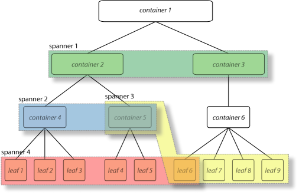
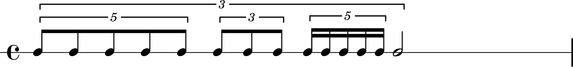
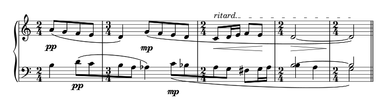
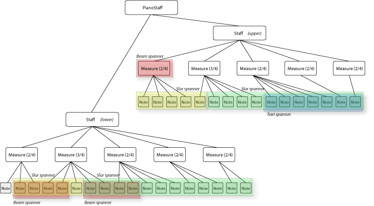

Leaf, Container, Spanner, Mark
==============================

At the heart of Abjad's Symbolic Score-Control lies a powerful model
that we call the Leaf Container Spanner Mark, or LCSM, model of the musical
score. 

The LCSM model can be schematically visualized as a superposition of
two complementary and completely independent layers of structure: a
*tree* that includes the Containers and the Leaves, and a layer of
free floating *connectors* or Spanners.

There can be any number of Spanners, they may overlap, and they may
connect to different levels of the tree hierarchy. The spanner
attach to the elements of the tree, so a tree structure must exist for
spanners to be made manifest.

Example 1
---------

To understand the whys and hows of the LCSM model implemented in
Abjad, it is probably easier to base the discussion on concrete
musical examples. Let's begin with a simple and rather abstract
musical fragment: a measure with nested tuplets.

What we see in this little fragment is a measure with 4/4 meter, 14
notes and four tuplet brackets prolating the notes. The three bottom
tuplets (with ratios 5:4, 3:2, 5:4) prolate all but the last note. The
topmost tuplet prolates all the notes in the measure and combines with
the bottom three tuplets to doubly prolate all but the last note. 
The topmost tuplet as thus prolates three tuplets, each of which in 
turn prolates a group of notes. We can think of a tuplet as
*containing* notes or other tuplets or both. Thus, in our example,
the topmost tuplet contains three tuplets and a half note. Each of the
tuplets contained by the topmost tuplet in turn contains five, three,
and five notes respectively. If we add the measure, then we have a
measure that contains a tuplet that contains tuplets that contain
notes. The structure of the measure with nested tuplets as we have
just described it has two important properties:

#. It is a *hierarchical* structure.
#. It follows *exclusive membership*, meaning that each element in
   the hierarchy (a note, a tuplet or a measure) has one and only one
   *parent*. In other words a single note is not contained in more than
   one tuplet simultaneously, and no one tuplet is contained in more
   than one other tuplet at the same time.

What we are describing here is a tree, and it is the structure of
Abjad *containers*.

While this tree structure seem like the right way to represent the
relationships between the elements of a score, it is not enough.
Consider the tuplet example again with the following beaming
alternatives:

Beaming alternative 1:

.. image:: images/lcs-2.png

Beaming alternative 2:

.. image:: images/lcs-3.png

Beaming alternative 3:

.. image:: images/lcs-4.png

Clearly the beaming of notes can be totally independent from the
tuplet groupings. Beaming across tuplet groups implies beaming across
nodes in the tree structure, which means that the beams do not adhere
to the *exclusive (parenthood) membership* characteristic of the
tree. Beams must then be modeled independently as a separate and
complementary structure. These are the Abjad *spanners*.

Below we have the score of our tuplet example with alternative beaming
and its the Leaf-Container-Spanner graph. Notice that the colored blocks
represent spanners.

Beaming alternative 3 (graph):

.. image:: images/lcs-tuplet-spanned.png

Example 2
---------

As a second example let's look at the last five measures of Bartók's
*Wandering* from Mikrokosmos vol. III. As simple as it may seem, these
five measures carry with them a lot of information pertaining to
musical notation.

.. note::
   Please refer to the :doc:`Bartok example 
   </chapters/examples/bartok/index>` for a step by step 
   construction of the musical fragment and its full Abjad code.

There are many musical signs of different types on the pages: notes,
dynamic markings, clefs, staves, slurs, etc. These signs are
structurally related to each other in different ways. Let's start by
looking at the larger picture. The piano piece is written in two
staves. As is customary, the staves are graphically grouped with a
large curly brace attaching to them at the beginning or each system.
Notice that each staff has a variety of signs associated with it.
There are notes printed on the staff lines as well as meter
indications and bar lines. Each note, for example, is in one and only
one staff. A note is never in two staves at the same time. This is
also true for measures. A measure in the top staff is not
simultaneously drawn on the top staff and the bottom staff. It is
better to think of each staff as having its own set of measures.
Notice also that the notes in each staff fall within the region of one
and only one measure, i.e. measures seem to contain notes.
There is not one note that is at once in two measures  
(this is standard practice in musical notation, but it need not always be the case.)

As we continue describing the relationships between the
musical signs in the page, we begin to discover a certain structure,
or a convenient way of structuring the score for conceptualization and
manipulation. All the music in a piano score seems to be written in
what we might call a *staff group*. The staff group is *composed of*
two staves. Each staff in turn appears to be composed of a series or
measures, and each measure is composed of a series of notes. So again
we find that the score structure can be organized hierarchically as a
tree. This tree structure looks like this:

Notice again though that there are elements in the score that imply
and require a different kind of grouping. The two four eighth-note
runs in the lower staff are beamed together across the bar line and,
based on our tree structure, across tree nodes. So do the slurs, the
dynamics markings and the ritardando indication at the top of the
score. As we have seen in the tuplets example, all these groups
running across the tree structure can be defined with *spanners*.
